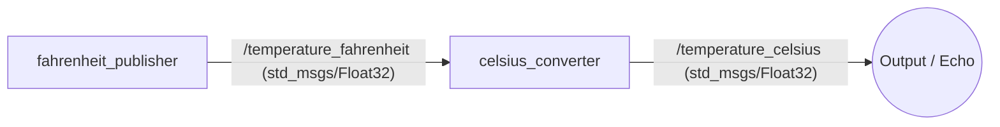

# `far_nsi_abel` package
ROS 2 C++ package. [](https://docs.ros.org/en/humble/)

## CSOMAG MŰKÖDÉSE (Architecture)

A csomag két C++ node segítségével végez hőmérséklet-konverziót (Fahrenheit -> Celsius):

1. **`fahrenheit_publisher`**: 
   - Periodikusan generál és publikál Fahrenheit értékeket a `/temperature_fahrenheit` topicra.
2. **`celsius_converter`**: 
   - Feliratkozik a `/temperature_fahrenheit` topicra, átszámítja a kapott értéket Celsiusra ($C = (F - 32) \cdot \frac{5}{9}$), majd publikálja az eredményt a `/temperature_celsius` topicra.

### Mermaid Diagram




# `far_nsi_abel` package
ROS 2 C++ package.  [](https://docs.ros.org/en/humble/)
## Packages and build

It is assumed that the workspace is `~/ros2_ws/`.

### Clone the packages
``` r
cd ~/ros2_ws/src
```
``` r
git clone [https://github.com/farkasabel/far_nsi_abel](https://github.com/farkasabel/far_nsi_abel)
```

### Build ROS 2 packages
``` r
cd ~/ros2_ws
```
``` r
colcon build --packages-select far_nsi_abel --symlink-install
```

<details>
<summary> Don't forget to source before ROS commands.</summary>

``` bash
source ~/ros2_ws/install/setup.